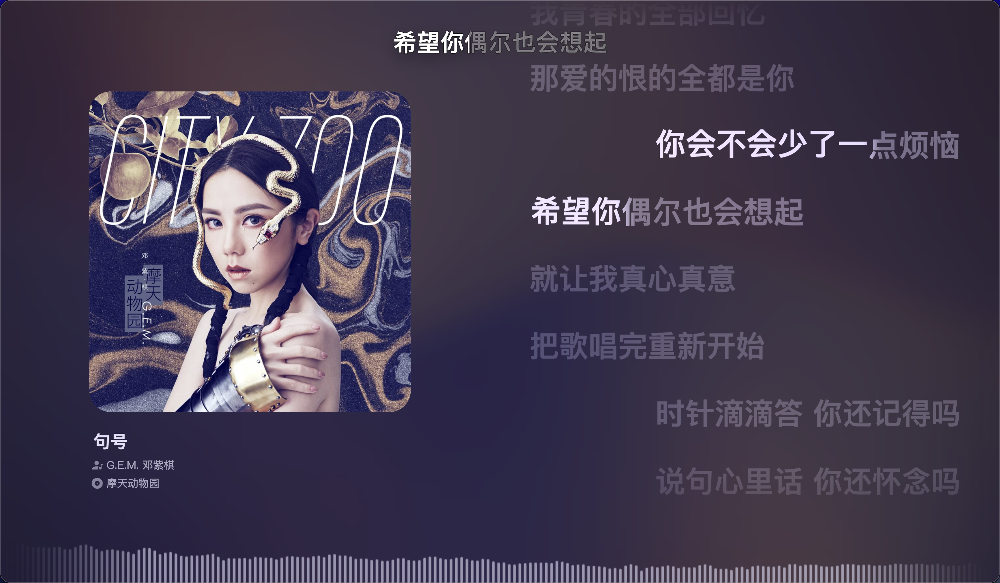
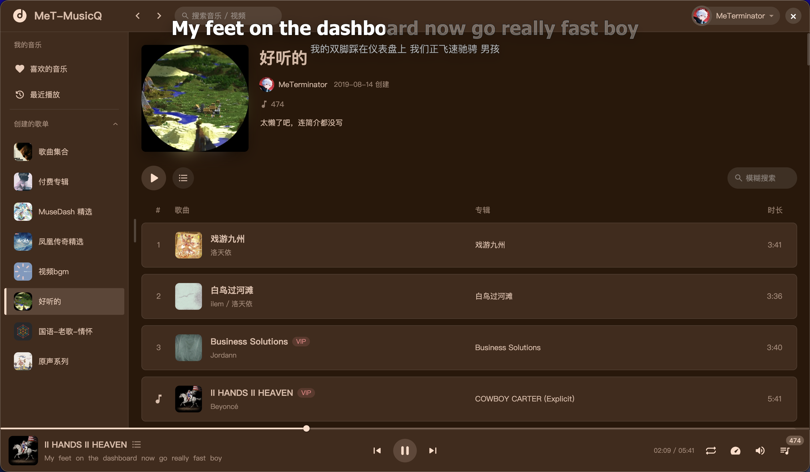
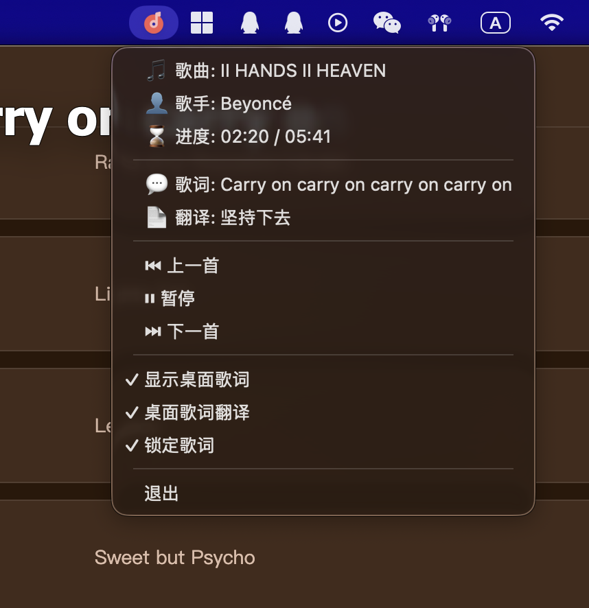
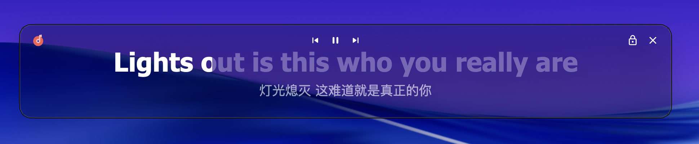

# MeT-Music_App

> MeT-Music 桌面客户端，包含桌面歌词，后台播放，播放控制等功能。由 Electron 编写，支持多平台。

## 图片预览

* 全屏播放器 Full Screen Player


* 播放列表页 Song List Page


* 菜单 Menu


* 桌面歌词 Desktop Lyrics


## 本地开发

### 1. 环境准备

确保你的计算机上已安装 [Node.js](https://nodejs.org/) (建议使用 LTS 版本)。

### 2. 克隆项目

```bash
git clone https://github.com/MeTerminator/MeT-Music_App.git
cd MeT-Music_App

```

### 3. 安装依赖

```bash
npm install
```

### 4. 启动开发模式

```bash
npm run start
```

## 主要功能

* **多平台支持**：支持 Windows, macOS 以及 Linux。
* **精美 UI**：极简设计的全屏播放器，动态背景视觉效果。
* **桌面歌词**：支持置顶、锁定、自定义颜色与字体的桌面歌词窗口。
* **系统级控制**：支持媒体键控制（播放/暂停、上一曲、下一曲）及系统通知。
* **托盘管理**：最小化到系统托盘，后台持续播放。
* **快捷键**：支持全局快捷键操作，无需切回窗口即可控制音乐。


## 技术栈

* **Framework**: [Electron](https://www.electronjs.org/)
* **Frontend**: [Vanilla.js](https://developer.mozilla.org/en-US/docs/Web/JavaScript) + [Vue.js](https://vuejs.org/)
* **Build Tool**: [Vite](https://vitejs.dev/)

---

## 打包构建

执行以下命令将应用打包为可执行文件：

```bash
npm run make
```

打包后的文件将存放在 `dist` 目录中。


## 贡献指南

1. Fork 本仓库。
2. 创建你的特性分支 (`git checkout -b feature/AmazingFeature`)。
3. 提交你的修改 (`git commit -m 'Add some AmazingFeature'`)。
4. 推送到分支 (`git push origin feature/AmazingFeature`)。
5. 开启一个 Pull Request。


## 开源协议

本项目采用 MIT License 开源协议。
