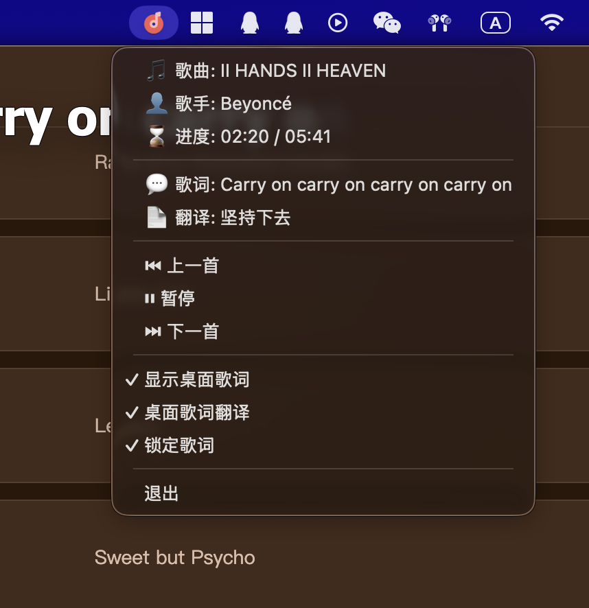

# MeT-Music_App

> MeT-Music 桌面客户端，包含桌面歌词，后台播放，播放控制等功能。由 Electron 编写，支持多平台。

## 图片预览

* 全屏播放器 Full Screen Player


* 播放列表页 Song List Page


* 菜单 Menu


* 桌面歌词 Desktop Lyrics


## 本地开发

### 1. 环境准备

确保已安装 [Node.js](https://nodejs.org/) LTS 和 [pnpm](https://pnpm.io/)。

### 2. 克隆项目

```bash
git clone https://github.com/MeTerminator/MeT-Music_App.git
cd MeT-Music_App
```

### 3. 安装依赖

```bash
pnpm install
```

### 4. 启动开发模式

```bash
pnpm start
```

## 主要功能

* **多平台支持**：支持 Windows, macOS 以及 Linux。
* **精美 UI**：极简设计的全屏播放器，动态背景视觉效果。
* **桌面歌词**：支持置顶、锁定、自定义颜色与字体的桌面歌词窗口。
* **系统级控制**：支持媒体键控制（播放/暂停、上一曲、下一曲）及系统通知。
* **托盘管理**：最小化到系统托盘，后台持续播放。
* **快捷键**：支持全局快捷键操作，无需切回窗口即可控制音乐。
* **外部 API**：可选的本地 HTTP / WebSocket 接口，供外部程序查询播放状态与控制播放。

## 外部 API

设置窗口 → **外部 API** 中开启（默认关闭）。服务默认仅绑定 `127.0.0.1`、**不含任何鉴权**；
需要局域网访问时请显式开启「允许局域网访问」，并仅在可信网络中使用。

* 基础路径：`http://127.0.0.1:<port>/api`，默认端口 `14558`
* 数据格式：请求与响应均为 JSON，时间单位为毫秒
* 成功响应：控制类接口返回 `{ "ok": true }`；参数非法返回 `400`
* 播放器尚未就绪（主窗未加载/UI 版本过旧）时，取数类接口返回 `501`

| 方法 | 路径 | 说明 |
| --- | --- | --- |
| GET | `/api/info` | 应用与连接信息 |
| GET | `/api/status` | 播放状态 |
| GET | `/api/volume` | 当前音量 |
| GET | `/api/now-playing` | 不含完整歌词的轻量快照 |
| GET | `/api/lyrics` | 当前曲目的完整解析歌词 |
| POST | `/api/play` `/api/pause` `/api/stop` | 播放 / 暂停 / 停止 |
| POST | `/api/next` `/api/prev` | 下一曲 / 上一曲 |
| POST | `/api/seek` | 跳转，body `{ "positionMs": number }` |
| POST | `/api/volume` | 设置音量，body `{ "volume": 0~1 }` |

WebSocket 需在外部 API 之上额外开启，地址 `ws://127.0.0.1:<port>/ws`（与 HTTP 同端口）：

* 下行消息带 `kind` 字段：`hello`（连接建立，附连接数）、`event`（播放事件推送）、`ack`（命令成功）、`error`（命令失败）
* 上行命令统一用 `op` 标识：`play` / `pause` / `stop` / `next` / `prev`、
  `seek`（附 `positionMs`）、`setVolume`（附 `volume`）

```bash
curl http://127.0.0.1:14558/api/status
curl -X POST http://127.0.0.1:14558/api/seek \
  -H "Content-Type: application/json" -d '{ "positionMs": 60000 }'
```


## 技术栈

* **Framework**: [Electron](https://www.electronjs.org/)
* **Frontend**: [Vanilla.js](https://developer.mozilla.org/en-US/docs/Web/JavaScript) + [Vue.js](https://vuejs.org/)
* **Build Tool**: [Vite](https://vitejs.dev/) + [Electron Forge](https://www.electronforge.io/)

---

## 打包构建

执行以下命令将应用打包为可执行文件：

```bash
pnpm dist
```

打包后的文件将存放在 `dist` 目录中。


## 贡献指南

1. Fork 本仓库。
2. 创建你的特性分支 (`git checkout -b feature/AmazingFeature`)。
3. 提交你的修改 (`git commit -m 'Add some AmazingFeature'`)。
4. 推送到分支 (`git push origin feature/AmazingFeature`)。
5. 开启一个 Pull Request。


## 开源协议

本项目采用 MIT License 开源协议。
